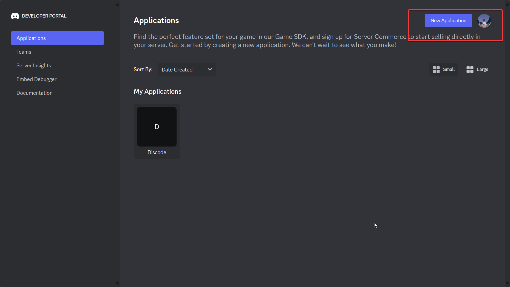
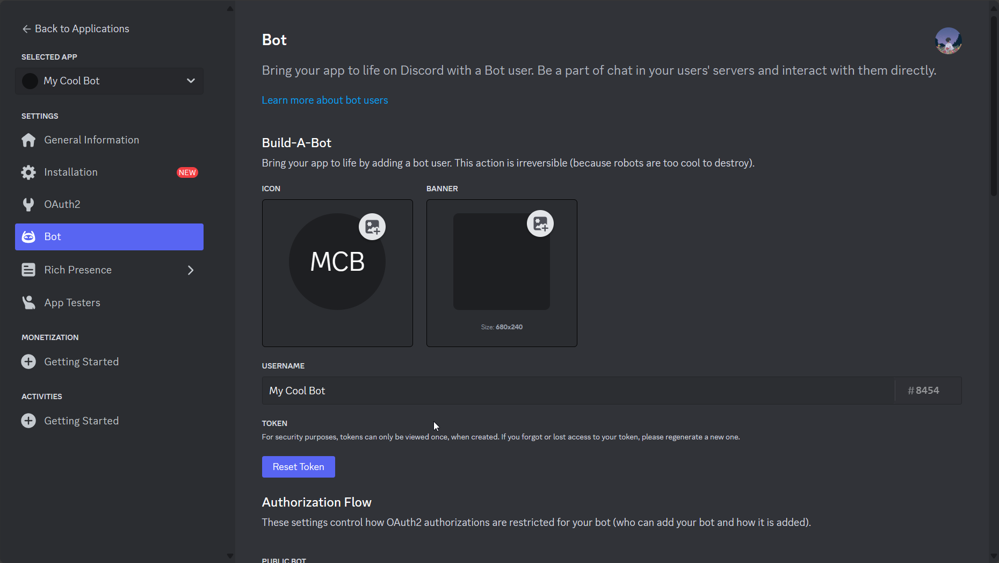

# Creating your first bot

Now that you have installed Discode, let's create your first discode bot.

## Discord-side Setup

### Creating an application

If you're new to creating bots, you should be aware that you have to create an actual Discord bot user through Discord. This page would guide you step-by-step. Simply, click the button below to head over to the `Discord Developer Portal`

[Developer Portal :fontawesome-brands-discord:](https://discord.com/developers/applications){ .md-button target="_blank"}

Now you are in this page:

{ align=center }

Next, click on "New Application" on the top right

You will be asked a name, you can name it whatever you like. :white_check_mark: the Terms of Services and you will be presented with this page:

{ align=center }

!!! note

    The description of the application is the "About Me" section of your bot. You can leave it blank or write something fun.

Click on "Bot"

Now, you are here:

{ align=center }

Give your bot a nice name, change it's profile picture and maybe give it your own banner too.

Scroll down and toggle the settings shown below:

{ align=center }

Finally, scroll up again and  copy the token of your new bot by clicking Reset Token > Copy. You're gonna need it later.

{ align=center }

!!! warning
    Please note that you can only copy your token once without resetting it. This means that if you lost it, you are gonna have to reset the token and obtain a new token instead.

!!! danger
    It is extremely important that you keep the token of this bot safe. If it is leaked, attackers can use this token to maliciously use your bot. Think of this token as the bot's password. With the password, the bot is accessible anywhere.

Also, that token in the screenshot is useless!

### Inviting your bot

1. Click on OAuth2 on the left pane
2. Scroll down to "OAuth2 URL Generator" then click on "bot"
3. Select the permissions you want for your bot
4. Click copy and paste the url in a new tab!

Here's a demonstration:

<video width="640"  controls>
    <source src="../../images/getting-started/oauth.webm" type="video/webm">
</video>

