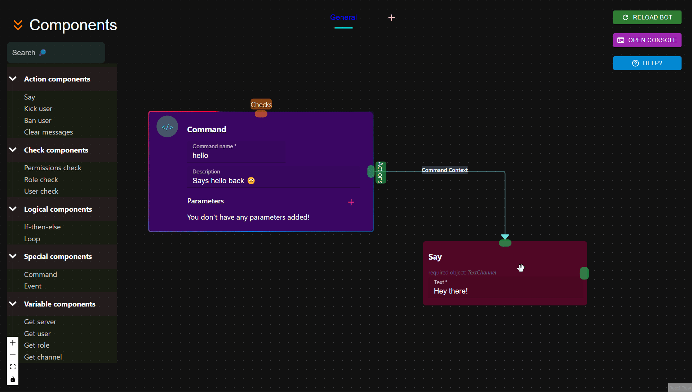

# Creating your first command

Since you created a new project, let's create your very own command!

## Say command

### What we'll be creating:

We will create a simple command named 'say' that has a [parameter](/discode/guides/parameters) named `text`.

Then, the bot would simply send back whatever text was passed to it. 

### Example

> `User`: !*say* _Hello World!_  
> `Bot`: Hello World!

### Procedure

Okay let's start. Firstly, when you create the project you will be presented with a sample hello command. It simply just says Hello, World. Let's delete this and start from scratch.

Click on the two nodes and delete it.

!!! tip

    Deleting a node is as simple as clicking it then hitting the `backspace` key.

??? tip "How to select multiple nodes at once?"

    You can press and hold the shift key then drag your mouse by clicking it over the nodes you want to delete. This makes a group selection. Now press the `backspace` key and watch them dissapear

Now let's do these steps.

1. Drag and drop a "Command" from **Special Components**
2. Change the name to `say`
3. Add a description (optional)
4. Add a parameter with the **+**
5. Name the parameter to `text` (this can be whatever you want)
6. Change the parameter type to **Text**

You created the command!

7. Now drag and drop a "Say" node from **Action Components**
8. Connect the command to the say action
9. Write `{text}` in the say action

You have now created the say action.

The command we want is now ready, therefore hit reload bot and execute the command.

Here's a video demonstration of what we just did:

### Demonstration

<video  controls>
    <source src="../../images/getting-started/demo.webm" type="video/webm">
</video>

