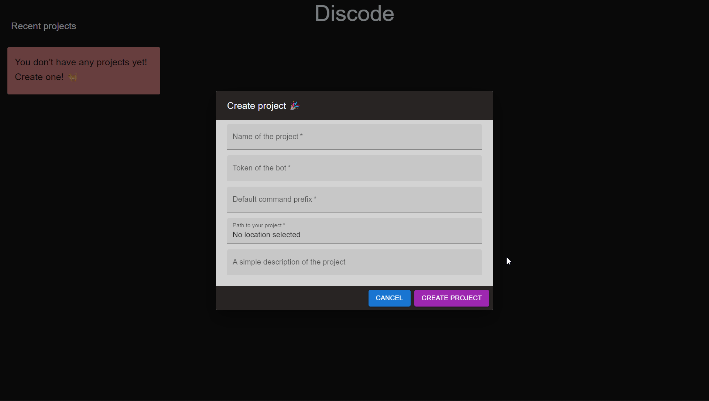

# Creating your first project

Now that you created your discord bot through discord, let's bring it to life through **Discode** 

## Creating a project

When you open Discode you have two big buttons in the center of the screen.

1. Create project

2. Open existing project

Pretty self explanatory, right?

Let's create a new one.

After clicking on  `Create Project` you will be prompted with a dialog that has some data to be filled.

### Command prefix

Almost all of these values are self explanatory by it's name. However, if you are confused about what "default command prefix" means, it is basically the character users require to type before invoking a command. i.e ([prefix]command)

- !hello
- ?help

