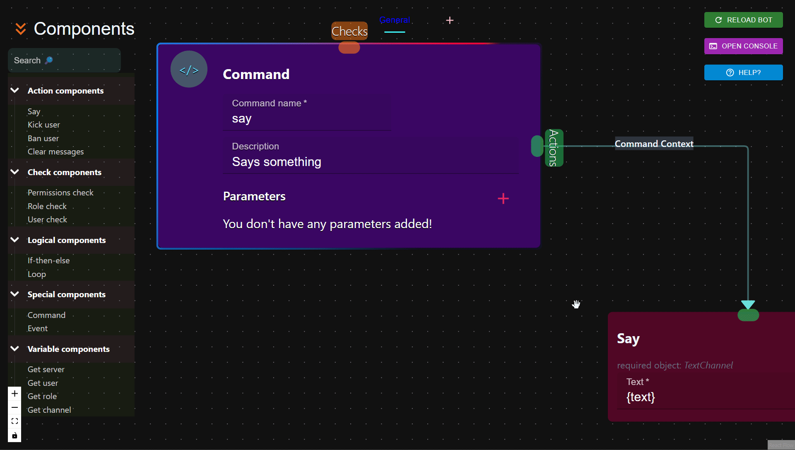
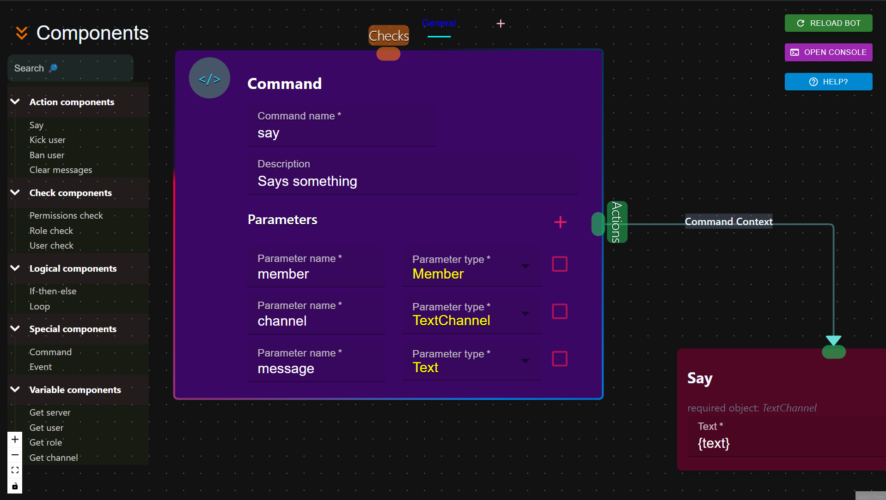
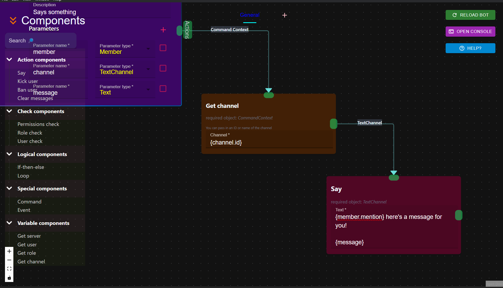
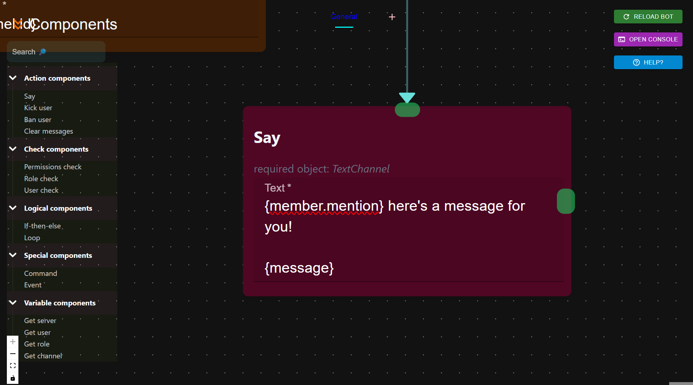

# An Introduction to Parameters

## What are parameters?

Command parameters are a way of passing data to your commands. This means that whatever you say after invoking the command can be accessed in your discode project as a "parameters".

Let's learn the difference between **parameters** and **arguments**:

### Arguments

Arguments are whatever you pass next to the command name when you are invoking the command.

Let's say for instance, we have a command called 'say'

> `User`: !**say** @John hello!

In the above command invocation, we have passed 2 arguments. The first argument is `@John` and the second is `hello!`.

Similarly, we can pass an unlimited amount of arguments to the command.

### Parameters

Now, we need a way to access these arguments in our Discode project right? That's when parameters come in.

When you create a command, you can define parameters by hitting the :fontawesome-solid-plus: next to parameters. This will create a new parameter. You'll notice that a parameter name field with a parameter type appears.

The **parameter name** is a required field. You can name this parameter whatever you want but it is convenient for you if you name it to something that makes sense. 

!!! info
    Eventhough you can name a parameter whatever you want, you can't have spaces in your parameter name. For instance `cool user` is not allowed :x: and `cool_user` is correct :white_check_mark:

???+ tip "How do I delete a parameter?"
    Right click on any parameter and it would remove the last parameter from the list of parameters in your command

Let's take an example to demonstrate how command parameters work.  
Let's say the user is invoking the command like so:

> `User`: !**say** @John #my-text-channel Discode is awesome don't you think??

In this case, 3 command arguments have been passed:

* `@John`
* `#my-text-channel`
* `Discode is awesome don't you think??`

Now, let's access these arguments in a command.

1. We'll create 3 parameters in our command
2. Name one `member` and give it a type of `Member`
3. Name one `channel` and give it a type of `TextChannel`
4. Name the last one `message` and give it a type of `Text`

Now our command should look like this:

You can now access the values of these parameters by using curly braces eg: `{parametername}` within your actions. Here's an example that would send the `message` in the `channel`.

!!! tip 
    If you ever want to make a parameter required as in, an argument must be entered in the command: you can check the checkbox on the right. Now users are gonna have to enter an argument for the required ones or the command is gonna error out(which you can handle in an error handler)

#### Parameter types

As of now, the parameter types that are available as follows.

| Type      | Description                          |
| :--------- | :---------------------------------- |
| `Member`       | Accepts a member mention, ID or name |
| `TextChannel` | Accepts a channel mention, channel ID or channel name |
| `Text`    | Accepts anything and converts into a text |
| `Number` | Accepts number  |
| `Role` | Accepts a role mention, role ID or role name |
| `Server` | Accepts a server ID or server name |
| `User` | Accepts a user mention, ID or name |

#### How do parameters work?

The way these parameters work is simple. Basically, when you provide an argument for a parameter, Discode is gonna try to convert that argument to whatever type the parameter is. For instance if you have a `Member` type parameter then Discode is gonna take that argument, check if it's a mention, ID or name and attempt to convert that to a Member object for you. If Discode cannot find that specific member, then the command is gonna throw an error.

Each parameter returns an object of that type. Meaning, you will have access to all it's attributes.

In the above example `Member` object has an attribute called 'mention' that mentions the member. You can learn about all these attributes in the reference section.

## Consume All

### :octicons-move-to-end-24: Last parameter

You may have noticed that in the example we used [here](#parameters), the last argument had multiple words and characters but all the previous arguments had only one word/no spaces. Why doesn't Discode consider the different words in the last argument as separate parameters?

To answer this question, Discode automatically consumes all remaining arguments if it's the last parameter. 

Meaning, if a command has 3 parameters: 

* Discode is gonna: 
    * take the **first argument** and use it as the **first parameter**,
    * take the **second argument** and use it as the **second parameter**,

    * take the **rest of the remaining arguments** and use it as the **third parameter**

##### Why?

This was done for convenience, so that users don't have to worry about having an argument that requires more than one word.

##### What if I want it to not consume the rest?

That's simple, just create an extra parameter that you're not gonna use. That last parameter is gonna consume whatever else is passed after your actual parameters are used by the user.

##### Does this work for all types?

Currently this only works for `Text` but other types are gonna have this feature too. 

### :octicons-move-to-end-24: Consuming multiple arguments in multiple parameters

Now, let's say you want multiple arguments in each of your parameters. To do this, you can use **single quotes** when you are invoking the command.

> `User`: ?**say** 'Hello This is a title' 'This is the body of my message' 'This is the end of the message'

Now Discode would  interpret your command like so:

* `Hello This is a title` - **first parameter**
* `This is the body of my message` - **second parameter**
* `This is the end of the message` - **third parameter**

